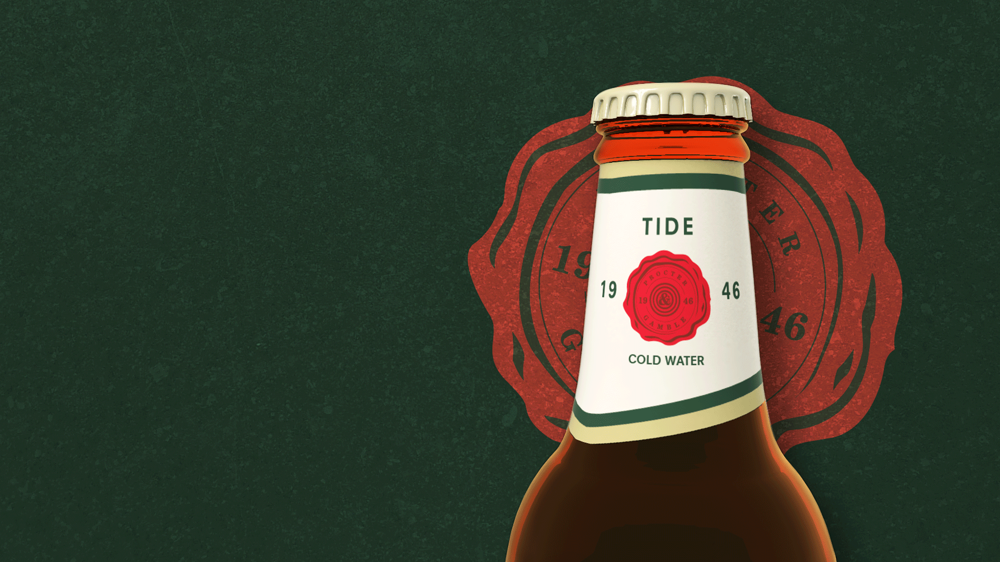

# Tide - Beer Scented Detergent - Final Integrated Project :computer:



## Hello There! Good to have you here! 👋

This is a HTML, CSS and JavaScript based project done for the Final Integrated Project of the Interactive Media Design program at Fanshawe College. Built with the latest technologies and best practices in web design, all the visuals, code, and functionality were built by me (Eduardo, such a cool guy!) from scratch!

## The challenge :cold_sweat:

Our task was to build a five-page not-so-static webpage using HTML, CSS and JavaScript.

One of the main requirements was to build some interactivity with JS, including but not limited to: micro interactions, UI designs, animations, and the main task: store some data in an array and retrieve it somewhere in the page (this can be located in the 'How to Use' page).

## Features :metal:

This project was built using the latest web development technologies, and also, for the visuals, Cinema 3D, After Effects and Adobe Premiere were put into work.

### 3D Elements :moyai:
	- All the bottles and 3D animations were built using Cinema 4D;

### Visual Effects :clapper:
	- Both videos present on the page were recorded, edited, colour graded and finished by me, on After Effects and Premiere.


### Graphics :framed_picture:
	- The Tide Brand and labels were drawn and vectorized from scratch.

	- Background images were taken from a royalty-free source, edited, and customized to our necessities.

### Animations :joystick:
	- The basic animations were built with keyframes on css, such as svgs;
	- Animations triggered on scroll were built using the AOS Library, authorized by Trevor Van Rys;
		The code snippet is:
		``` JavaScript
		<script src="https://unpkg.com/aos@next/dist/aos.js"></script>
		<script>
		  AOS.init();
		</script>
		```

## MIT Licence :page_with_curl:
Copyright (c) 2021 Eduardo Schlichting

Permission is hereby granted, free of charge, to any person obtaining a copy of this software and associated documentation files (the "Software"), to deal in the Software without restriction, including without limitation the rights to use, copy, modify, merge, publish, distribute, sublicense, and/or sell copies of the Software, and to permit persons to whom the Software is furnished to do so, subject to the following conditions:

The above copyright notice and this permission notice shall be included in all copies or substantial portions of the Software.

THE SOFTWARE IS PROVIDED "AS IS", WITHOUT WARRANTY OF ANY KIND, EXPRESS OR IMPLIED, INCLUDING BUT NOT LIMITED TO THE WARRANTIES OF MERCHANTABILITY, FITNESS FOR A PARTICULAR PURPOSE AND NONINFRINGEMENT. IN NO EVENT SHALL THE AUTHORS OR COPYRIGHT HOLDERS BE LIABLE FOR ANY CLAIM, DAMAGES OR OTHER LIABILITY, WHETHER IN AN ACTION OF CONTRACT, TORT OR OTHERWISE, ARISING FROM, OUT OF OR IN CONNECTION WITH THE SOFTWARE OR THE USE OR OTHER DEALINGS IN THE SOFTWARE.

# Installation :open_file_folder:
Copy repository from Github to preferred project location. You're good to go and feel what we are feeling in this web build!

# Contributing :pushpin:
1. Fork it!
2. Create your feature branch: `git checkout -b my-new-feature`
3. Commit your changes: `git commit -am 'Add some feature'`
4. Push to the branch: `git push origin my-new-feature`
5. Submit a pull request :D

# History :scroll:
Write what you have done!

# Credits :clipboard:
Write credits, we don't wanna have problems here right, mate? 👋
